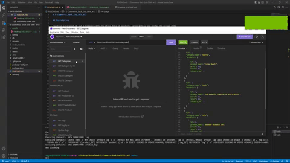

# E-Commerce_Back_End_OEM_w13

## Description

Creating a backend of and E-Commerce Site to store date of products using models and routes to access data. user can use the back-end to create, read, update, or delete products, categories, and tags.

## Table of Contents

- [Installation](#installation)
- [Usage](#usage)
- [License](#license)
- [Contributing](#contributing)
- [Tests](#tests)
- [Questions](#questions)

  ## Installation

  Clone the Repository, Run an "npm install as well as install mysql,express, dotenv, sequelize. then Run 'npm start', user will need to use insomnia to see data.

  ## Usage

  Once installed is complete run "npm start' to start the server then use insomnia at "http://localhost:3001/api" and to access tags, products, and categories. at the end do /tags, /product, or /categories.

  

  ## Video Walkthrough

  [Xavier Marquez Ecommerce Walkthrough](https://drive.google.com/drive/folders/1QcVw0TIrSQK-8_diZTjyimaOr5PACbse?usp=sharing)

  ## Credits

  Xavier Marquez

  ## License

  
  https://mit-license.org/

  ## Questions

  contact me here:

* Email: xavier.ray.marquez@gmail.com
* GitHub [XavierReyMarquez](https://github.com/XavierReyMarquez)
